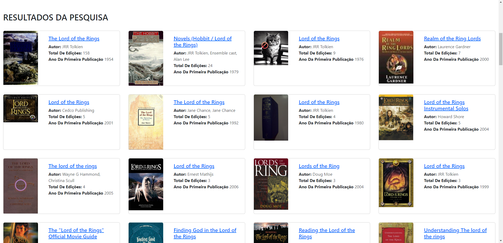
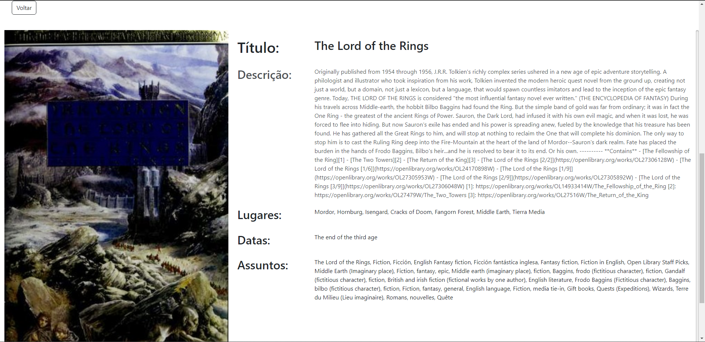

# BooksCentral

> Bem-vindo ao Books Central! Uma central para amantes de livros.

O Books Central é um website projetado para entusiastas de livros descobrirem e explorarem seus livros favoritos. Se você está procurando descobrir novos livros, a Books Central é o lugar certo.

## Recursos

- Navegue por uma vasta coleção de livros de vários gêneros.
- Descubra informações sobre os livros desejados.

## Tecnologias Utilizadas

- Front-end: HTML, CSS, JavaScript, React e Bootstrap 5
- Back-end: OpenLibrary API
- Hospedagem: Vercel

## Capturas de Tela

Aqui estão algumas capturas de tela do Books Central em ação:

### Página Inicial

### Busca de livros

### Detalhes do Livro

## Começando

### Pré-requisitos

- Node.js (versão 18.16.0)

### Instalação

1. Clone o repositório:

   - git clone https://github.com/allysonflb/BooksCentral.git

2. Instale as dependências:

   - cd BooksCentral
    
   - npm install

3. Inicie a aplicação:

   - npm start

4. Abra o seu navegador e visite http://localhost:3000 para acessar a BooksCentral.     

### Contribuindo

Contribuições são bem-vindas! Se você tiver alguma ideia, sugestão ou encontrar algum problema, por favor, abra uma issue ou envie um pull request.

### Licença

Este projeto está licenciado sob a Licença MIT.

